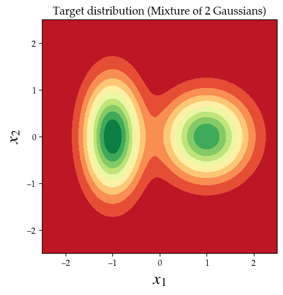
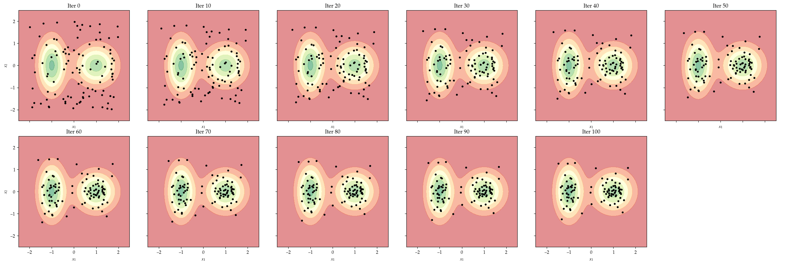
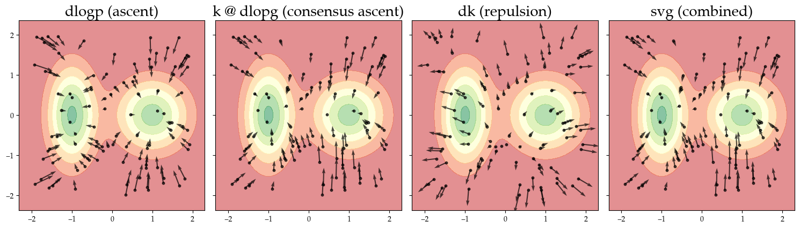

# Stein Variation Gradient Descent (or ascent) SVGD

This notebooks showcases a basic implementation of Stein in PyTorch, to understand how the method works. The name of the notbook `turn_the_stein.ipynb` is a reference to the German meaning of Stein, i.e. stone. Turning the stone around is a metaphor for uncovering what is hidden and see a new perspective.

This is the reference of the **original SVGD paper Liu et al. 2016**:
Liu, Qiang, and Dilin Wang. "Stein variational gradient descent: A general purpose bayesian inference algorithm." Advances in neural information processing systems 29 (2016). [Link to paper on NeurIPS](https://proceedings.neurips.cc/paper_files/paper/2016/file/b3ba8f1bee1238a2f37603d90b58898d-Paper.pdf).

The code is based on 
- [Dilin Wang's original implementation](https://github.com/dilinwang820/Stein-Variational-Gradient-Descent/blob/master/python/svgd.py)
- [Stratis Markou's random walks blogpost on SVGD](https://github.com/stratisMarkou/random-walks/blob/master/random-walks/book/papers/svgd/svgd.ipynb)
    - however this implementation does not use the anatlytically derived gradient of the kernel as the repulsive term
    - this implementation also does not use the median heuristic but a fixed lengthscale i.e. bandwidth. 

Other resources that helped me understand Stein include:
- [Stein Variational Gradient Descent: Theory and
Applications](https://www.cs.utexas.edu/~lqiang/PDF/svgd_aabi2016.pdf)
- [Depth first blogpost](https://www.depthfirstlearning.com/2020/SVGD)

# Summary of turn_the_stein.ipynb

Given is a target distribution, which is a bimodal Gaussian Mixture in 2D:

We can retrieve the density of the target distribution at any given location x.

Particles are initialised at (to a degree arbitrary) locations. This is the prior distribution. Iterations of SVGD transport these particles to approximate the posterior. This approximation of the target distribution is characteristic for Variational Inference (VI) approaches.

To understand how SVGD works, particularly the **consensus ascent** and the **repulsion term** that each update is composed of, we also visualise these vector fields individually. These are the vector fields at t = 1:

# Notes on implementation:

- use **median heuristic** for bandwidth/lengthscale

## Repulsive term

Analytical derivations of the gradient of the kernel

\begin{table}[h!]
\centering
\begin{tabular}{|c|l|}
\hline
\textbf{Quantity} & \textbf{Expression} \\
\hline
RBF Kernel & \( k(x, x') = \exp\left(-\frac{1}{h} \|x - x'\|^2 \right) \) \\
\hline
Gradient w.r.t. \( x \) & \( \nabla_x k(x, x') = -\frac{2}{h} (x - x') \cdot k(x, x') \) \\
\hline
Gradient w.r.t. \( x' \) & \( \nabla_{x'} k(x, x') = +\frac{2}{h} (x - x') \cdot k(x, x') \) \\
\hline
\end{tabular}
\caption{RBF kernel and its gradients}
\end{table}

We require the gradient w.r.t. \( x' \), see paper, so that a repulsion is achieved. The kernel is symmetric by definition. 

# Ideas

- Stein for Optimisation (i.e. in Bayesian Optimisation, when trajectories matter)
- Stein for sparse GPs (inducing points), see [Tighter sparse variational Gaussian processes
](https://arxiv.org/abs/2502.04750)
- preservation of probability mass (transport of probability mass), currently normalisation agnostic
