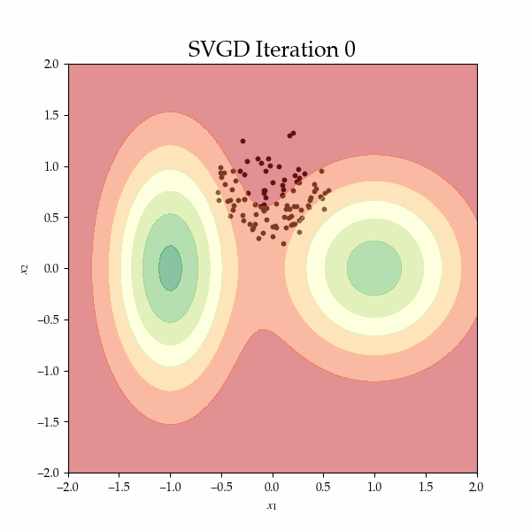
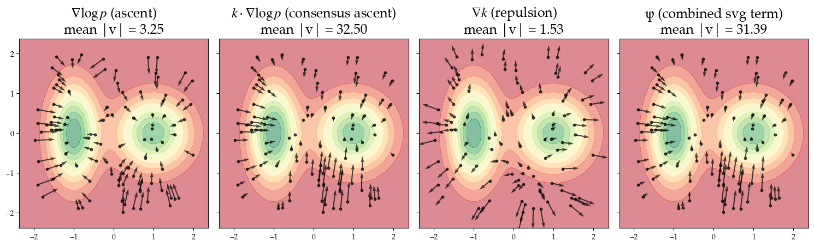
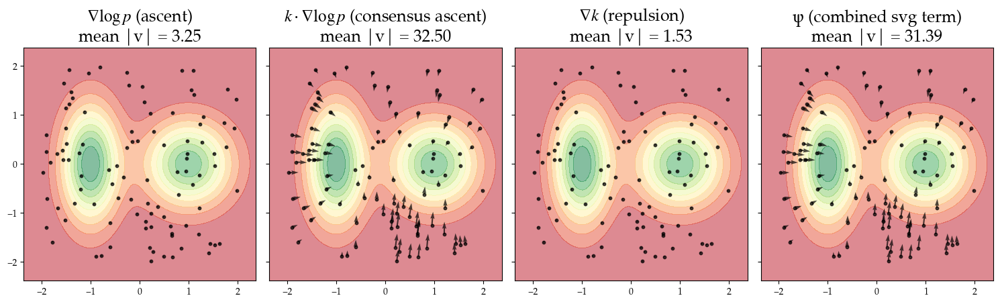

# Stein Variation Gradient Descent (or ascent) SVGD

This notebooks showcases a basic implementation of Stein in PyTorch, to understand how the method works. The name of the notbook `turn_the_stein.ipynb` is a reference to the German meaning of Stein, i.e. stone. Turning the stone around is a metaphor for uncovering what is hidden and see a new perspective.

This is the reference of the **original SVGD paper Liu et al. 2016**:
Liu, Qiang, and Dilin Wang. "Stein variational gradient descent: A general purpose bayesian inference algorithm." Advances in neural information processing systems 29 (2016). [Link to paper on NeurIPS](https://proceedings.neurips.cc/paper_files/paper/2016/file/b3ba8f1bee1238a2f37603d90b58898d-Paper.pdf).

The code is based on 
- [Dilin Wang's original implementation](https://github.com/dilinwang820/Stein-Variational-Gradient-Descent/blob/master/python/svgd.py)
    - The use a single function to return the kernel and its gradient to avoid duplicate computations.
- [Stratis Markou's random walks blogpost on SVGD](https://github.com/stratisMarkou/random-walks/blob/master/random-walks/book/papers/svgd/svgd.ipynb)
    - however this implementation does not use the anatlytically derived gradient of the kernel as the repulsive term
    - this implementation also does not use the median heuristic but a fixed lengthscale i.e. bandwidth. 

Other resources that helped me understand Stein include:
- [Stein Variational Gradient Descent: Theory and
Applications](https://www.cs.utexas.edu/~lqiang/PDF/svgd_aabi2016.pdf)
- [Depth first blogpost](https://www.depthfirstlearning.com/2020/SVGD)

# Summary of `turn_the_stein.ipynb`

This is what Stein can do:

Let's break it down: Given is a target distribution, which is a bimodal Gaussian Mixture in 2D:

We can retrieve the density of the target distribution at any given location x.

Particles are initialised at (to a degree arbitrary) locations. This is the prior distribution. Iterations of SVGD transport these particles to approximate the posterior. This approximation of the target distribution is characteristic for Variational Inference (VI) approaches.

To understand how SVGD works, particularly the **consensus ascent** and the **repulsion term** that each update is composed of, we also visualise these vector fields individually. These are the vector fields at t = 1:

The true magnitude of the repulsion term is much smaller than the other terms. The quiver plot automatically scales the magnitude. 

## Key facts
- Subclass of VI (Variational Inference)
- In case of 1 particle it reduces to an MAP estimate
- Given the initialisation SVGD is deterministic, unlike MCMC
- General-purpose because no functional form for a family of distribution must be assumed as in classical VI
- Stein gradient are guiding the particles in the steepest direction of KL decrease
- drawing on Stein operators, the Stein identity and the Reproducing Kernel Hilbert Space
- gradient updates do not require access to normalisation term
- joint consideration of repulsion

# To Do
- implement quasi-Newton Stein to avoid some failure modes

### Notes on implementation

- use **median heuristic** for bandwidth/lengthscale

## Repulsive term

Analytical derivations of the gradient of the kernel (Latex code only renders locally.)

- RBF Kernel: $ k(x, x') = \exp\left(-\frac{1}{h} \|x - x'\|^2 \right) $
- Gradient w.r.t. x: $ \nabla_x k(x, x') = -\frac{2}{h} (x - x') \cdot k(x, x')$
- Gradient w.r.t. x':$ \nabla_{x'} k(x, x') = +\frac{2}{h} (x - x') \cdot k(x, x')$

We require the gradient w.r.t. \( x' \), see paper, so that a repulsion is achieved. The kernel is symmetric by definition. 

### Derivations
The gradient of \( k(x, x') \) with respect to \( x \) is computed as follows:

First, differentiate the kernel expression. Let \( r = \|x - x'\|^2 \), so:
\[
k(x, x') = \exp\left(-\frac{1}{h} r \right)
\]
The derivative of the exponential function, following the chain rule, is:
\[
\frac{d}{dx} \exp\left(-\frac{1}{h} r \right) = \exp\left(-\frac{1}{h} r \right) \cdot \left(-\frac{1}{h} \frac{d}{dx} r \right)
\]
Now for the gradient with respect to \( x' \), differentiate \( \|x - x'\|^2 \) with respect to \( x' \):
\[
\frac{d}{dx'} \|x - x'\|^2 = -2(x - x')
\]
Thus, the gradient with respect to \( x' \) is:
\[
\nabla_{x'} k(x, x') = +\frac{2}{h} (x - x') \cdot k(x, x')
\]

# Ideas

- Stein for Optimisation (i.e. in Bayesian Optimisation, when trajectories matter, exploitation exploration trade-off, relation to Thompson sampling or BORE)
- Stein for sparse GPs (inducing points), see [Tighter sparse variational Gaussian processes
](https://arxiv.org/abs/2502.04750)
- preservation of probability mass (transport of probability mass), currently normalisation agnostic as we operate in the gradient space, relation to Normalising Flows

# Questions

- Does the repulsive force ever also attract? 

